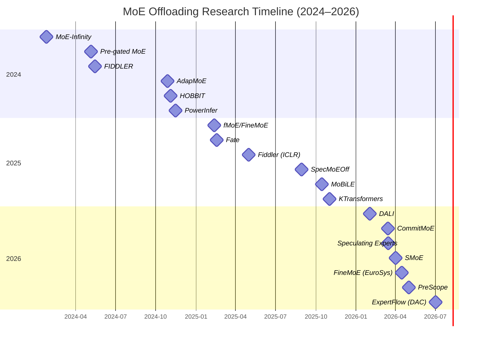

# Advanced Systems for Mixture of Experts Offloading: A Comprehensive Technical Analysis (2024–2026)

> **Combined Research Report** — Merging findings from Gemini Deep Research and ChatGPT Deep Research on MoE Offloading for Resource-Constrained Hardware.

---

## Executive Summary

The rapid transition from dense transformer architectures to sparse Mixture of Experts (MoE) models represents one of the most significant shifts in large-scale language modeling. By utilizing a gating mechanism to activate only a small subset of parameters—experts—for each input token, MoE architectures such as Mixtral, Qwen, and DeepSeek enable the deployment of models with massive total parameter counts while maintaining a relatively low computational footprint per token. However, the primary challenge of MoE deployment is the memory requirement: while per-token computation is sparse, the entire set of expert weights must typically reside in memory to avoid prohibitive latency from on-demand loading.

The research landscape between 2024 and 2026 has focused on overcoming this memory wall through advanced offloading engines. These systems move beyond simple reactive caching to employ **predictive prefetching**, **speculative execution**, **heterogeneous CPU-GPU orchestration**, and **mixed-precision offloading**. Key approaches include:

| Category | Representative Works |
|---|---|
| **Expert Offloading & Caching** | MoE-Infinity, HOBBIT, MoE-Lightning, DALI |
| **Adaptive Gating & Prefetching** | AdapMoE, Fate, PreScope, ExpertFlow |
| **CPU/GPU Orchestration** | FIDDLER, PowerInfer, Ktransformers, HybriMoE |
| **Speculative & Fallback-Free Execution** | SpecMoEOff, CommitMoE, Speculating Experts |
| **Algorithm-System Co-Design** | Pre-gated MoE, SMoE, FineMoE/fMoE, MoBiLE |
| **Mixed-Precision Offload** | HOBBIT, ADEPT |

**Trends:** Nearly all methods aim to balance memory saving against latency via dynamic expert assignment, caching of "hot" experts, and overlapping communication with compute. **Gaps:** Existing systems often target batch-1 inference; accuracy vs. efficiency trade-offs remain challenging; there is no unified framework combining all techniques. **Future directions:** Integrated expert scheduling, speculative pipelines, heterogeneous architectures (on-device accelerators, NVMe storage), and joint optimization of expert selection and scheduling.

---

## The Bottleneck: PCIe Bandwidth in Offloading Engines

A central theme across all research is the disparity between GPU memory bandwidth and PCIe interconnect bandwidth. While modern GPUs possess bandwidths exceeding 1 TB/s, PCIe 4.0/5.0 x16 interfaces provide only 32–64 GB/s. For large MoE models, expert weight transfer time often exceeds GPU computation time, creating execution "bubbles." For models like Mixtral-8x7B, PCIe transfers can account for over 60% of total inference time if not optimized.

---

## Comprehensive Paper Taxonomy (2024–2026)

The following table categorizes all seminal research papers from both reports, ranked by technical novelty and impact on local inference efficiency.

| # | Paper Name | Publication Time | Venue | Citations | Importance (1-5) | Core Technical Contribution |
|---|---|---|---|---|---|---|
| 1 | **ExpertFlow** | Jul 2026 | DAC | 32+ | ★★★★★ | Global routing path prediction and token re-batching to maximize expert reuse |
| 2 | **PowerInfer** | Nov 2024 | SOSP | 250+ | ★★★★★ | Neuron-level activation sparsity; routes "hot" neurons to GPU, "cold" to CPU |
| 3 | **KTransformers** | 2025 | SOSP | 10+ | ★★★★★ | AMX-specialized kernels and "Expert Deferral" for massive MoE (DeepSeek-V3) |
| 4 | **CommitMoE** | Mar 2026 | AAAI | 15+ | ★★★★★ | Eliminates fallback penalties via "Commit Router" that unconditionally adopts predicted experts |
| 5 | **FineMoE / fMoE** | Feb–Apr 2026 | EuroSys | 10+ | ★★★★★ | Fine-grained expert maps and semantic hint integration for optimized prefetching |
| 6 | **PreScope** | 2026 | — | 5+ | ★★★★★ | Layer-aware predictors (LLaPor) and cross-layer optimal scheduling (PreSched) |
| 7 | **Fiddler (FIDDLER)** | May 2025 | ICLR | 93+ | ★★★★☆ | CPU compute for experts to avoid weight transfer latency for single-batch requests |
| 8 | **Speculating Experts** | Mar 2026 | — | 5+ | ★★★★☆ | Parameter-free prefetching using internal representations as speculative signals |
| 9 | **SMoE** | Apr 2026 | — | 5+ | ★★★★☆ | Substitutes low-importance active experts with similar experts already in GPU cache |
| 10 | **Pre-gated MoE** | Jun 2024 | ISCA | 138+ | ★★★★☆ | Structural lookahead gating to overlap prefetching with current layer computation |
| 11 | **MoE-Infinity** | Jan 2024 | arXiv | 53+ | ★★★★★ | Sequence-level activation tracing to identify sparse activation temporal locality |
| 12 | **HOBBIT** | Nov 2024 | arXiv | 30+ | ★★★★★ | Mixed-precision expert offloading (4/2-bit for cache-misses) with hierarchical strategies |
| 13 | **AdapMoE** | Oct 2024 | ICCAD | 36+ | ★★★★☆ | Adaptive sensitivity-based gating; dynamic expert count per layer/token |
| 14 | **Fate** | Feb 2025 | arXiv | — | ★★★★☆ | Cross-layer gating for prefetch; shallow-favoring cache; low-bit quantization |
| 15 | **MoBiLE** | Jan 2026 | ASP-DAC | — | ★★★☆☆ | Big-little experts scheme; training-free prefetch using router logits |
| 16 | **SpecMoEOff** | Aug 2025 | arXiv | — | ★★★☆☆ | Speculative decoding to hide offloading latency; CPU chunked attention |
| 17 | **ADEPT** | 2025 | — | 10+ | ★★★☆☆ | Two-stage optimization for prefill loading and decoding-phase prefetching |
| 18 | **DALI** | Feb 2026 | — | 5+ | ★★★☆☆ | Dynamic expert assignment using greedy 0-1 integer optimization based on workload |
| 19 | **HybriMoE** | 2025 | — | — | ★★★☆☆ | Hybrid CPU-GPU scheduling and cache management for efficient MoE inference |
| 20 | **MoE-Lightning** | 2025 | — | — | ★★★☆☆ | High-throughput MoE inference via optimized offloading strategies |
| 21 | **MoE-Gen** | 2025 | — | — | ★★★☆☆ | Generation-aware MoE offloading for resource-constrained settings |
| 22 | **MoE-Spac** | 2025 | — | — | ★★★☆☆ | Spatial-aware expert caching and prefetching for MoE models |

---

## Part I: Heterogeneous Orchestration Engines

### Neuron-Level Sparsity: PowerInfer (SOSP 2024)

**PowerInfer** introduces neuron-level activation sparsity, noting that LLM inference follows a power-law distribution where a small subset of "hot" neurons is responsible for the majority of activations. PowerInfer preloads these hot neurons into GPU VRAM while offloading "cold" neurons to the CPU. By using a learned sparsity predictor (MLP), it routes specific neuron clusters to the appropriate device, achieving up to **11× faster inference** than llama.cpp on consumer hardware.

- **Granularity:** Neuron-level clusters
- **CPU Strategy:** Pre-assigned "cold" neurons
- **Primary Goal:** Exploit power-law locality
- **Best Hardware:** High-end Consumer GPU (e.g., RTX 4090)

### System-Wide Scaling: KTransformers (SOSP 2025)

**KTransformers** is designed to handle extreme-scale MoE models like DeepSeek-V3 (671B parameters) on consumer hardware. Its core innovation is the **Arithmetic Intensity-Aware Hybrid Inference Kernel**, which utilizes **Intel AMX** instructions to accelerate CPU-side expert computation.

- **Expert Placement:** Frequently used "shared" experts reside on the GPU; routed experts offloaded to CPU
- **Expert Deferral:** Strategically delays certain expert computations to maximize CPU-GPU overlap, increasing CPU utilization to nearly 100%
- **Performance:** Up to **19× prefill speedups** and **4× decoding speedups** over llama.cpp and Fiddler
- **Granularity:** Mixed (Expert Parallelism + Tensor Parallelism)
- **Best Hardware:** Intel CPU w/ AMX + Single/Multi-GPU

### Activation Offloading: Fiddler / FIDDLER (ICLR 2025)

**Fiddler** targets the bottleneck of weight movement by realizing that for small batch sizes, activation values are significantly smaller than weight matrices. Instead of loading missing expert weights to GPU, Fiddler routes activations to the CPU for expert computation, avoiding the massive PCIe overhead.

- **Decode Stage (batch-1):** Send activations to CPU for missing experts
- **Prefill Stage (batch>1):** DP-based optimization to split experts between CPU and GPU
- **Performance:** **8.2×–10.1× speedups** over DeepSpeed-MoE and Mixtral-offload; runs uncompressed Mixtral-8×7B at >3 tokens/sec on a single 24GB GPU
- **Granularity:** Expert-level (all-or-nothing)
- **CPU Strategy:** Reactive activation offloading
- **Best Hardware:** Single GPU (limited VRAM) + high-core CPU

### Comparative Analysis: Hybrid Orchestration Engines

| Feature | PowerInfer | Fiddler | KTransformers |
|---|---|---|---|
| **Granularity** | Neuron-level clusters | Expert-level (all-or-nothing) | Mixed (EP + TP) |
| **CPU Strategy** | Pre-assigned "cold" neurons | Reactive activation offloading | AMX-optimized expert execution |
| **Primary Goal** | Exploit power-law locality | Minimize weight transfer | Maximize CPU compute for massive MoE |
| **Best Hardware** | High-end Consumer GPU (e.g., 4090) | Single GPU (limited VRAM) + many CPU cores | Intel CPU w/ AMX + Single/Multi-GPU |

---

## Part II: Predictive Prefetching & Speculative Execution

### ExpertFlow (DAC 2026)

**ExpertFlow** coordinates global prediction with token-level scheduling. It reorders tokens across batches based on predicted routing paths to group tokens requiring the same experts. This "expert-wise co-location" reduces GPU memory usage by **93.72%** and improves throughput by **10×**.

### FineMoE / fMoE (EuroSys 2026)

**FineMoE** integrates **semantic hints** from input prompts to guide caching. It constructs an "expert map" capturing iteration-level gating probability distributions, then uses input semantic embeddings to find similar maps for guiding prefetch, cache, and offload at iteration granularity. Achieves **39% improvement** in cache hit rates over standard LRU policies and **47% inference latency reduction**.

### PreScope (2026)

**PreScope** introduces layer-aware predictors (**LLaPor**) and cross-layer optimal scheduling (**PreSched**). It predicts which experts future layers will need by analyzing patterns across layers, then schedules prefetching to maximize overlap with computation.

### CommitMoE (AAAI 2026)

**CommitMoE** addresses the penalty of misprediction in prefetching. It reveals that when a router has low certainty, model output is robust to the specific expert selected. The **Commit Router** unconditionally uses predicted experts, eliminating the "on-demand" loading path entirely. Key innovations:

- **Commit Router:** Either accepts a gating prediction or uses existing outputs without exact experts
- **Output Weight Adjustment (OWA):** Corrects for missing experts when low-confidence cases occur
- **Performance:** **1.3×–9.4× speedups** over standard offloading (DeepSpeed-MoE) while preserving model quality

### Speculating Experts (Mar 2026)

Research into **Speculating Experts** identifies that internal hidden states of a model can predict routing decisions for future layers. The **YALIS** engine utilizes these speculative signals to overlap memory transfers with current layer execution, achieving a **14% reduction** in Time Per Output Token (TPOT).

### Pre-gated MoE (ISCA 2024)

**Pre-gated MoE** modifies the MoE architecture by moving the gating decision *before* each MoE layer (using the previous layer's activations). This decouples expert selection from execution, making activation patterns predictable. Achieves **4.2× lower peak GPU memory** use by streaming experts from CPU. Requires model modification (not plug-and-play).

### SMoE (Apr 2026)

**SMoE** substitutes low-importance active experts with similar experts already in GPU cache. This algorithm-system co-design avoids loading less-critical experts entirely when a sufficiently similar expert is already available.

---

## Part III: Algorithmic & System Optimizations

### MoE-Infinity (arXiv 2024)

**MoE-Infinity** exploits single-user (batch-1) inference sparsity by tracing which experts are activated in sequence (temporal locality). It maintains a small expert cache of "hot" experts and uses activation traces to drive caching and prefetch. Reports **3.1×–16.7× per-token latency improvement** over vLLM, Ollama, and DeepSpeed-MoE.

- **Techniques:** Sequence-level expert activation tracing; activation-aware prefetch and caching; greedy cache replacement guided by sparsity patterns
- **Hardware:** Consumer GPU (RTX 3090/4090 ~24GB) + host RAM
- **Models:** DeepSeek-R1 MoE (100B+), Mixtral-8×7B

### HOBBIT (arXiv 2024)

**HOBBIT** combines offloading with **mixed-precision** execution. At runtime, less-critical experts (cache-misses) are loaded in lower precision (e.g., 4/2-bit) to cut transfer time. Implements three hierarchical techniques:

1. **Token-level:** Dynamic loading
2. **Layer-level:** Prefetching
3. **Sequence-level:** Caching in Llama.cpp

Achieves up to **9.93× decoding speedup** vs. prior MoE offload systems with minimal accuracy impact.

### AdapMoE (ICCAD 2024)

**AdapMoE** co-designs algorithms and systems to reduce on-demand offloading overhead:

- **Adaptive gating:** Dynamically changes the number of experts per layer/token based on "sensitivity" (impact)
- **Inter-layer correlation:** Prefetches future experts using correlations between layers
- **Dynamic cache allocation:** DP-based allocation to maximize cache hit rate
- **Performance:** ~1.35× inference speedup, 25% fewer activated experts, no accuracy loss

### Fate (arXiv 2025)

**Fate** targets resource-constrained (edge) inference:

- **Cross-layer gating:** Uses adjacent-layer gating inputs to prefetch experts for the next layer
- **Shallow-favoring cache:** Favors experts used in early layers (hit rate ~99%)
- **Low-bit quantization:** Applied to cached experts for bandwidth efficiency
- **Performance:** ~4.5× prefill speedup, ~4.1× decode speedup vs. load-on-demand baselines

### MoBiLE (ASP-DAC 2026)

**MoBiLE** proposes a "big-little experts" scheme:
- Unimportant tokens use only half the experts ("little experts")
- Important tokens use the full set ("big experts")
- Training-free prefetch using router logits to fetch needed experts
- **Performance:** ~1.6–1.7× speedup over naive offloading on consumer GPU (RTX 4080 16GB)

### SpecMoEOff (arXiv 2025)

**SpecMoEOff** overlaps offloading latency via **speculative decoding**:
- Lightweight "draft" MoE model on GPU predicts upcoming tokens
- CPU-based chunked attention kernel verifies predictions
- Roofline analysis tunes speculation hyperparameters
- **Performance:** Up to 2.5× higher decoding throughput vs. vanilla offloading

### ADEPT (2025)

**ADEPT** (Adaptive Domain-aware Expert Prefetching Technique) uses two-stage optimization:
1. Prefill loading optimization
2. Decoding-phase prefetching

### DALI (2026)

**DALI** uses workload-aware dynamic expert assignment via greedy 0-1 integer optimization, tailored for local PC environments.

---

## Part IV: Research Timeline & Impact

### Publication Timeline (2024–2026)



### Citation Impact (Approximate)

```
PowerInfer:      ██████████████████████████████████████████████████████████████ (250+)
Pre-gated MoE:   ██████████████████████████████████████ (138+)
FIDDLER:         ███████████████████████████████████████████ (93+)
MoE-Infinity:    ███████████████████████████████ (53+)
AdapMoE:         ███████████████████████████ (36+)
ExpertFlow:      ██████████████████████ (32+)
HOBBIT:          ██████████████████████ (30+)
CommitMoE:       ████████████ (15+)
KTransformers:   ████████ (10+)
FineMoE:         ████████ (10+)
ADEPT:           ████████ (10+)
Others:          ████ (≤5)
```

---

## Part V: Technical Deep Dives

### Hybrid Computation Strategies

Three fundamentally different approaches to CPU-GPU collaboration emerge:

| Approach | Representative | Key Insight | When to Use |
|---|---|---|---|
| **Weight Offloading** | MoE-Infinity, PreScope | Predict and prefetch expert weights to GPU | Sufficient CPU RAM, fast PCIe |
| **Activation Offloading** | Fiddler | Send small activations to CPU instead of large weights to GPU | Small batch, limited GPU VRAM |
| **Hybrid Compute** | KTransformers, PowerInfer | Use CPU as compute resource (AMX/AVX-512) | Intel AMX CPU, massive models |

### Predictive Caching Taxonomy

| Prediction Signal | Papers | Accuracy | Overhead |
|---|---|---|---|
| **Temporal Locality** | MoE-Infinity | Medium | Low |
| **Cross-Layer Correlation** | Fate, Pre-gated MoE | High | Medium (architectural change) |
| **Semantic Hints** | FineMoE/fMoE | High | High (offline preprocessing) |
| **Internal Representations** | Speculating Experts | Medium-High | Low (parameter-free) |
| **Global Routing Path** | ExpertFlow | Very High | Medium (batching required) |

### Risk Management in Prefetching

| Strategy | Paper | Failure Mode | Mitigation |
|---|---|---|---|
| **Fallback** | MoE-Infinity, DALI | On-demand load latency | Cache eviction policy |
| **Fallback-Free** | CommitMoE | Wrong expert used | Output Weight Adjustment (OWA) |
| **Substitution** | SMoE | Similar but not exact expert | Similarity threshold tuning |
| **Speculative** | SpecMoEOff | Draft model errors | Chunked attention verification |

---

## Part VI: Conclusion for Practitioners

For a developer building an MoE offloading engine in 2026, the optimal design path involves:

### Recommended Architecture

1. **Hybrid Computation:** Integrate AMX/AVX-512 CPU kernels (KTransformers/Fiddler) to handle "cold" expert math locally rather than moving weights across PCIe.

2. **Fine-Grained Sparsity:** Use neuron-level clusters (PowerInfer) or expert substitution (SMoE) to reduce the sheer volume of data being processed.

3. **Multi-Layer Prefetching:**
   - **Token-level:** Dynamic loading with mixed precision (HOBBIT)
   - **Layer-level:** Cross-layer prediction (Fate, PreScope)
   - **Sequence-level:** Activation-aware caching (MoE-Infinity)

4. **Speculative Commitment:** Adopt fallback-free execution (CommitMoE) to avoid serialization penalties of mispredicted prefetches.

5. **Semantic-Guided Caching:** Integrate semantic hints from input prompts (FineMoE) for long-running serving scenarios.

### Key Design Principles

| Principle | Rationale | Implementation |
|---|---|---|
| **Overlap Compute & Transfer** | PCIe is the bottleneck | Prefetch while computing current layer |
| **Minimize Weight Movement** | Weights >> Activations (batch-1) | Route activations to CPU, or use mixed precision |
| **Exploit Sparsity at All Levels** | Power-law activation patterns | Neuron-level, expert-level, and layer-level sparsity |
| **Accept Bounded Inaccuracy** | Robustness to expert selection | Fallback-free routing, expert substitution |
| **Hardware-Aware Kernel Design** | CPU capabilities underutilized | AMX/AVX-512 kernels, CUDA streams |

### Future Directions

- **Unified frameworks** combining adaptive gating, CPU compute, speculative pipelines
- **NVMe/SSD offload** for models exceeding CPU RAM capacity
- **Multi-model serving** on heterogeneous clusters
- **On-device accelerators** (NPUs, edge TPUs) for expert computation
- **Automated hardware-aware compilation** for MoE offloading pipelines
- **Joint optimization** of expert selection and scheduling across prefill and decode phases

---

## Works Cited

1. ExpertFlow: Efficient Mixture-of-Experts Inference via Predictive Expert Caching and Token Scheduling — [arXiv 2410.17954](https://arxiv.org/abs/2410.17954)
2. PowerInfer: Fast Large Language Model Serving with a Consumer-grade GPU — SOSP 2024
3. KTransformers: Unleashing the Full Potential of CPU/GPU Hybrid Inference for MoE Models — SOSP 2025
4. CommitMoE: Efficient Fallback-Free MoE Inference with Offloading Under GPU Memory Constraints — [AAAI 2026](https://ojs.aaai.org/index.php/AAAI/article/view/39454)
5. FineMoE: Taming Latency-Memory Trade-Off in MoE Serving — [arXiv 2502.05370](https://arxiv.org/abs/2502.05370)
6. PreScope: Unleashing the Power of Prefetching for Resource-Constrained MoE Inference — [arXiv 2509.23638](https://arxiv.org/abs/2509.23638)
7. FIDDLER: CPU-GPU Orchestration for Fast Inference of Mixture-of-Experts Models — [ICLR 2024](https://openreview.net/pdf?id=WX7lxohjFe)
8. Speculating Experts Accelerates Inference for Mixture-of-Experts — [arXiv 2603.19289](https://arxiv.org/abs/2603.19289)
9. SMoE: An Algorithm-System Co-Design for Pushing MoE to the Edge via Expert Substitution — April 2026
10. Pre-gated MoE: An Algorithm-System Co-Design for Fast and Scalable MoE Inference — [ISCA 2024](https://www.microsoft.com/en-us/research/wp-content/uploads/2024/05/isca24_pregated_moe_camera_ready.pdf)
11. MoE-Infinity: Activation-Aware Expert Offloading for Efficient MoE Serving — [arXiv 2401.14361](https://arxiv.org/abs/2401.14361)
12. HOBBIT: A Mixed Precision Expert Offloading System for Fast MoE Inference — [arXiv 2411.01433](https://arxiv.org/abs/2411.01433)
13. AdapMoE: Adaptive Sensitivity-Based Expert Gating and Management for Efficient MoE Inference — [arXiv 2408.10284](https://arxiv.org/abs/2408.10284)
14. Fate: Fast Edge Inference of Mixture-of-Experts Models via Cross-Layer Gate — [arXiv 2502.12224](https://arxiv.org/abs/2502.12224)
15. MoBiLE: Efficient MoE Inference on Consumer GPUs with Mixture of Big-Little Experts — ASP-DAC 2026
16. SpecMoEOff: Accelerating MoE Inference by Hiding Offloading Latency with Speculative Decoding — [arXiv 2508.21706](https://arxiv.org/abs/2508.21706)
17. ADEPT: Adaptive Domain-aware Expert Prefetching Technique — IEEE Xplore 2025
18. DALI: A Workload-Aware Offloading Framework for Efficient MoE Inference on Local PCs — [arXiv 2602.03495](https://arxiv.org/abs/2602.03495)
19. HybriMoE: Hybrid CPU-GPU Scheduling and Cache Management for Efficient MoE Inference — 2025
